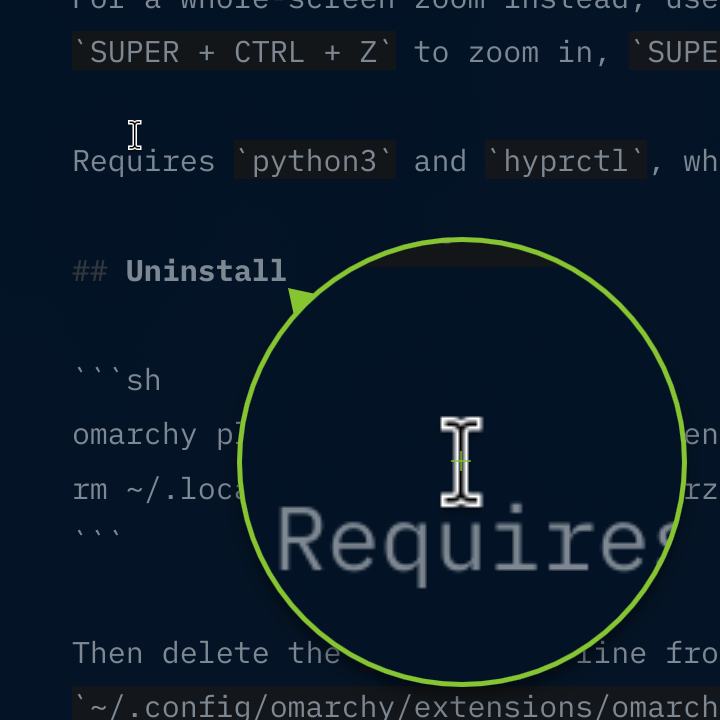
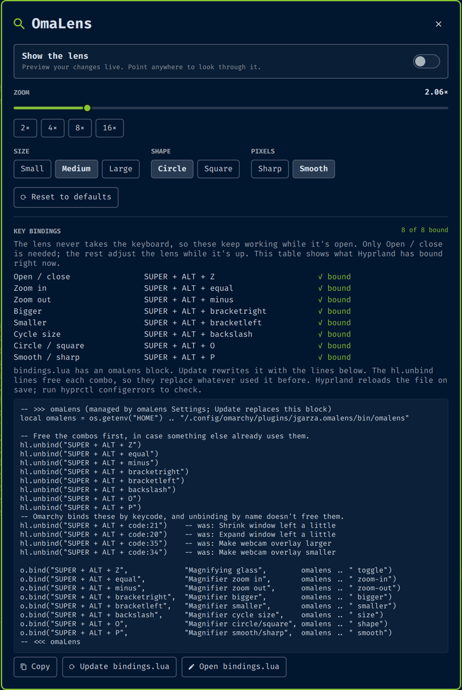

# omaLens



A live magnifying glass for Omarchy. A round lens floats just beside your
pointer and shows a magnified, live view of what's under the pointer.

The lens never takes the keyboard or the mouse: clicks, typing, and **every
Hyprland binding keep working while it's open**. You control the lens with
key bindings of your own (see below), and it stays up until you toggle it off.

## Install

```sh
omarchy plugin add https://github.com/jgarza9788/omaLens.git --enable
~/.config/omarchy/plugins/jgarza.omalens/extras/install.sh
```

The first line clones the plugin into `~/.config/omarchy/plugins/jgarza.omalens/`
and enables it. The second adds **omaLens** and **omaLens Settings** rows to the
Omarchy menu and an app-launcher entry. It's safe to run again.

To update later: `omarchy plugin update jgarza.omalens`.

Like every Omarchy plugin, omaLens runs unsandboxed inside the shell. It runs
`hyprctl`, `python3`, and `wl-copy`, and it writes `~/.config/hypr/bindings.lua`
only when you press **Add** or **Update** in the settings window (first copying
it to a new `bindings.lua.bak`, `bindings.lua.bak.1`, ... — an existing backup
is never overwritten).

## Open and close it

- **Menu:** `SUPER + SPACE` → **omaLens** (or type `lens`, `magnifier`, `zoom`).
  Pick it again to close.
- **App launcher:** search for *omaLens*
- **Command line:** `~/.config/omarchy/plugins/jgarza.omalens/bin/omalens toggle`

## Settings window



`SUPER + SPACE` → **omaLens Settings** (or type `lens settings`), or run
`omalens settings`. In the window you can:

- set zoom (slider or 2× / 4× / 8× / 16× presets), size, shape, and smoothing,
  with a live lens preview
- reset everything to the defaults
- see which lens actions Hyprland has bound right now, with their keys. For a
  missing one, it says whether the suggested combo is free or taken by something else.
  Binds are recognised by their description (`"Magnifying glass"` and so on), so
  keep those if you change the keys.
- copy the key-binding block below, add it to `~/.config/hypr/bindings.lua`, or
  open that file in your editor. The block is marked with `-- >>> omaLens` /
  `-- <<< omaLens`, so the same button later **updates** it in place. A copy of
  the previous file is kept as the first free `bindings.lua.bak`,
  `bindings.lua.bak.1`, ...

Everything works from the keyboard. `Tab` / `Shift + Tab` move between controls.
On the zoom slider, `←` `→` `↑` `↓` (or `h` `j` `k` `l`) step the zoom, `Page Up` /
`Page Down` double or halve it, and `Home` / `End` jump to the ends. In a button
group, `←` `→` pick a choice and `Enter` or `Space` selects it. `Esc` or a click
outside the card closes the window.

## Add key bindings

The easiest way is **Add to bindings.lua** in the settings window. To do it by
hand, put this block in `~/.config/hypr/bindings.lua`. It uses `SUPER + ALT`.
Stock Omarchy binds four of these keys by keycode (window resize and webcam
overlay size), so the block unbinds those keycodes as well:

```lua
-- >>> omaLens (managed by omaLens Settings; Update replaces this block)
local omalens = os.getenv("HOME") .. "/.config/omarchy/plugins/jgarza.omalens/bin/omalens"

-- Free the combos first, in case something else already uses them.
hl.unbind("SUPER + ALT + Z")
hl.unbind("SUPER + ALT + equal")
hl.unbind("SUPER + ALT + minus")
hl.unbind("SUPER + ALT + bracketright")
hl.unbind("SUPER + ALT + bracketleft")
hl.unbind("SUPER + ALT + backslash")
hl.unbind("SUPER + ALT + O")
hl.unbind("SUPER + ALT + P")
-- Omarchy binds these by keycode, and unbinding by name doesn't free them.
hl.unbind("SUPER + ALT + code:21")    -- was: Shrink window left a little
hl.unbind("SUPER + ALT + code:20")    -- was: Expand window left a little
hl.unbind("SUPER + ALT + code:35")    -- was: Make webcam overlay larger
hl.unbind("SUPER + ALT + code:34")    -- was: Make webcam overlay smaller

o.bind("SUPER + ALT + Z",             "Magnifying glass",        omalens .. " toggle")
o.bind("SUPER + ALT + equal",         "Magnifier zoom in",       omalens .. " zoom-in")
o.bind("SUPER + ALT + minus",         "Magnifier zoom out",      omalens .. " zoom-out")
o.bind("SUPER + ALT + bracketright",  "Magnifier bigger",        omalens .. " bigger")
o.bind("SUPER + ALT + bracketleft",   "Magnifier smaller",       omalens .. " smaller")
o.bind("SUPER + ALT + backslash",     "Magnifier cycle size",    omalens .. " size")
o.bind("SUPER + ALT + O",             "Magnifier circle/square", omalens .. " shape")
o.bind("SUPER + ALT + P",             "Magnifier smooth/sharp",  omalens .. " smooth")
-- <<< omaLens
```

Only the `SUPER + ALT + Z` binding is needed to open and close the lens. Add the others if you
want to adjust it while it's open.

Hyprland reloads the file on save. Check that it took with:

```sh
hyprctl configerrors
```

The `hl.unbind` lines free each combo first, so the lens bindings replace
anything that used them before. Unbinding by key name doesn't remove a bind made
by keycode (`code:NN`), which is why those get their own lines. If you pick
different keys, unbind those instead, and keep the descriptions
(`"Magnifying glass"` and so on): the settings window finds your binds by them.

### `omalens` commands

| Command    | Action                              |
|------------|-------------------------------------|
| `toggle`   | open or close the lens (default)    |
| `close`    | close the lens                      |
| `zoom-in`  | magnify more (×1.25, up to 24×)     |
| `zoom-out` | magnify less (down to 1.25×)        |
| `size`     | cycle small → medium → large        |
| `size small` / `size medium` / `size large` | jump to that size |
| `bigger`   | next size up (stops at large)       |
| `smaller`  | next size down (stops at small)     |
| `shape`    | circle ↔ square                     |
| `smooth`   | smooth ↔ sharp pixels               |
| `settings` | open or close the settings window   |

The three sizes are small (300 px), medium (600 px), and large (900 px).
Zoom, size, shape, and smoothing are saved to
`~/.config/omarchy/jgarza.omalens/settings.json`, so they survive shell restarts.
Changes from the key bindings and the settings window are both saved.

### Starting with other settings

To open the lens with particular settings, summon it with a JSON payload. The
payload lasts until the lens closes and is never saved; key-binding tweaks made
while it's open aren't saved either. Every field is optional:

| Field    | Values                        | Default      |
|----------|-------------------------------|--------------|
| `zoom`   | `1.25`–`24`                   | `2.5`        |
| `size`   | `"small"` / `"medium"` / `"large"` | `"medium"` |
| `shape`  | `"circle"` / `"square"`       | `"circle"`   |
| `smooth` | `true` / `false`              | `false` (sharp pixels) |

For example, a large square lens for inspecting pixels:

```lua
o.bind("SUPER + ALT + SHIFT + Z", "Pixel lens",
  [[omarchy-shell shell toggle jgarza.omalens '{"zoom":8,"size":"large","shape":"square"}']])
```

## How it works

- `OmaLens.qml` draws the lens on a small layer surface that takes no input,
  so clicks and keys go to whatever is underneath it. The surface shows a live
  capture of the monitor under the pointer, magnified around the pointer.
- The lens sits below and to the right of the pointer. Near a screen edge it
  glides around the pointer to whichever side fits, and moves back once there's
  room again. It travels around the pointer rather than across it, so it never
  covers the area it magnifies and never magnifies itself.
- Opening and closing animate like lifting a glass off the screen and putting
  it back. On open it springs up from 90% size, comes into focus from a blur,
  its shadow deepens, and the magnification ramps up to the set zoom. Closing
  is quicker and plays the same steps in reverse without the bounce. Every
  animation, including zoom, size, shape, and the glide around the pointer, is
  a spring, so it keeps its momentum if you change your mind mid-animation.
- `bin/omalens-cursor` polls Hyprland for the pointer position about 60 times
  a second, and only while the lens is open.
- The crosshair in the lens marks the pointer's spot.
- A small tail on the rim always points at the real pointer, so you can see
  which spot the lens is showing even when it's pushed against a screen edge.

Screenshots and screen recordings include the lens.

For a whole-screen zoom instead, use Hyprland's built-in keys:
`SUPER + CTRL + Z` to zoom in, `SUPER + CTRL + ALT + Z` to reset.

Requires `python3` and `hyprctl`, which ship with Omarchy.

## Uninstall

```sh
omarchy plugin remove jgarza.omalens
rm ~/.local/share/applications/jgarza-omalens.desktop
```

Then delete the `"omalens"` and `"omalens-settings"` lines from
`~/.config/omarchy/extensions/omarchy-menu.jsonc`, the omaLens block from
`~/.config/hypr/bindings.lua`, and the saved settings:

```sh
rm -r ~/.config/omarchy/jgarza.omalens
```

## Developing

The shell doesn't reload plugin QML on its own. After editing `OmaLens.qml` or
`LensSettings.qml`, run `omarchy-restart-shell`. `bin/omalens-bindings` is the
helper the settings window uses to read and rewrite the block in `bindings.lua`.
